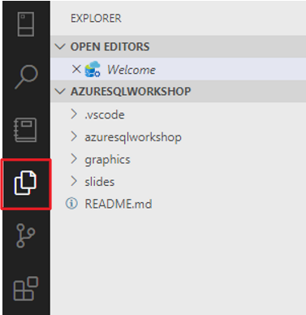
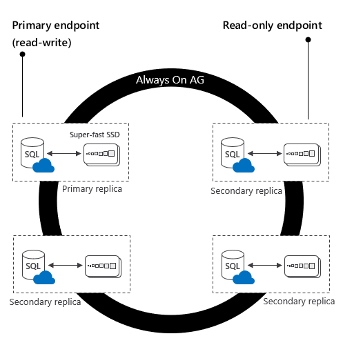
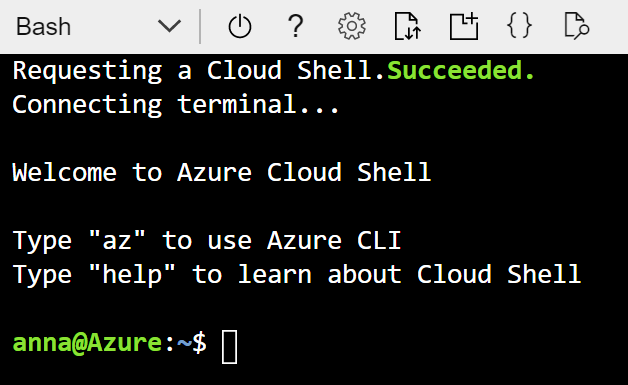
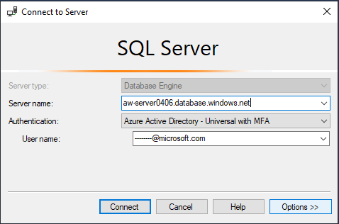

# The Azure SQL Workshop

#### <i>A Microsoft workshop from the SQL team</i>

<p style="border-bottom: 1px solid lightgrey;"></p>

 <h2>05 - Availability</h2>

> You must complete the [prerequisites](../azuresqlworkshop/00-Prerequisites.md) before completing these activities. You can also choose to audit the materials if you cannot complete the prerequisites. If you were provided an environment to use for the workshop, then you **do not need** to complete the prerequisites.   

Depending on the SLA, RTO, and RPO your business requires, Azure SQL has the options you need and built-in capabilities. In this module, you will learn how to translate your knowledge of backup/restore, Always On Failover cluster instances, and Always On Availability Groups to the options for business continuity in Azure SQL.


In this module, you'll cover these topics:  
[5.1](#5.1): Backup and restore   
&nbsp;&nbsp;&nbsp;&nbsp;&nbsp;&nbsp;(Bonus) [Activity 1](#1): Restore to a point in time  
[5.2](#5.2): Azure SQL high availability basics     
&nbsp;&nbsp;&nbsp;&nbsp;&nbsp;&nbsp;[Activity 2](#2): Basic HA in Azure SQL Database    
[5.3](#5.3): The highest availability  
&nbsp;&nbsp;&nbsp;&nbsp;&nbsp;&nbsp;[Activity 3](#3): Turn-key AGs in Business critical  
&nbsp;&nbsp;&nbsp;&nbsp;&nbsp;&nbsp;[Activity 4](#4): Geo-distributed auto-failover groups with read-scale in Business critical  

<p style="border-bottom: 1px solid lightgrey;"></p>

<h2><a name="5.1">5.1 Backup and restore</h2></a>


<br>

<p><a name="1"><b>(Bonus) Activity 1</a>: Undo errors to a point in time</b></p>

> Note: This is the first activity, but since restoring a database can take time, for the instructor-led version of this workshop, this will be a bonus activity to review or complete. If you are performing this in a self-study fashion, it is still recommended to review or complete the activity.  

In all organizations, big or small, accidents can happen. That's why you always have to have a plan for how you will restore to where you need to be. In SQL Server, ideally, you want choose to [restore to a point in time](https://docs.microsoft.com/en-us/sql/relational-databases/backup-restore/restore-a-sql-server-database-to-a-point-in-time-full-recovery-model?view=sql-server-ver15), but you can only do that if you are running in full recovery model. Under the bulk-logged recovery model, it's more likely that you'll have to recover the database to the end of the transaction log backup.  

One of the benefits of Azure SQL is that Azure can take care of all of this for you. Since Azure SQL manages your backups and runs in full recovery model, it can restore you to any point in time (you can even [restore a deleted database](https://docs.microsoft.com/en-us/azure/sql-database/sql-database-recovery-using-backups#deleted-database-restore)). In this activity, you'll see how a common error can be recovered using point in time restore (PITR). This is easy to do in the portal or programmatically, but in this activity you'll see how to do it with the Azure CLI.  

> Note: In this activity, you will use auditing in Log Analytics to determine the time of a dropped table done by accident. Auditing and Log Analytics were configured in Module 3, so be sure you have completed that before attempting this activity.

<p><b>Steps</b></p>

For this activity, you'll use the notebook called **pitr.ipynb** which is under `azuresqlworkshop\05-Availability\pitr\pitr.ipynb`. Navigate to that file in ADS to complete this activity, and then return here.   

> Hint: To navigate to the folder you opened in Module 2 in ADS, you can select the **Explorer** button on the left-hand taskbar.  
>   
> If you don't see this view, you can open **in a new tab** [Activity 3, Step 2 in Module 2](https://github.com/microsoft/sqlworkshops-azuresqlworkshop/blob/master/azuresqlworkshop/02-DeployAndConfigure.md#3) and repeat the open folder exercise.   

<p style="border-bottom: 1px solid lightgrey;"></p>

<h2><a name="5.2">5.2 Azure SQL high availability basics</h2></a>


<p><a name="2"><b>Activity 2</a>: Basic HA in Azure SQL Database</b></p>

In this activity, you'll get to see how the General purpose tier of Azure SQL Database behaves similarly to a Failover Cluster Instance on-prem. The main difference is that on-prem, this can be time-consuming or tricky to set up, but with Azure SQL, you get it out of the box.


<p><b>Steps</b></p>

**Step 1 - Connect to the Azure PowerShell module**  

Open PowerShell on your virtual machine (should be pinned to taskbar from Prerequisites) and run `Connect-AzAccount`. This will walk you through authenticating. This step basically sets you up to be able to use the Azure PowerShell module from Azure Data Studio.  

When this successful, you should see results like this (your account details with vary) in PowerShell. You can close PowerShell now.  

<pre>
Account                                            SubscriptionName                    TenantId
-------                                            ----------------                    --------
odl_user_165187@...com            Microsoft Managed Labs Spektra - 04           f94768c8-8714...</pre>

**Step 2 - Main activity**  

For the main part of this activity, you'll use the notebook called **basic-ha.ipynb** which is under `azuresqlworkshop\05-Availability\basic-ha\basic-ha.ipynb`. Navigate to that file in ADS to complete this activity, and then return here.     

<p style="border-bottom: 1px solid lightgrey;"></p>

<h2><a name="5.3">5.3 The highest availability</h2></a>

You've seen some of the capabilities that Azure SQL offers generally as far as high availability goes in Azure SQL. In this topic, you'll move to the Business critical service tier, which is meant to obtain the highest performance and availability of all Azure SQL service tiers (General purpose, Hyperscale, Business critical). Business critical is meant for mission-critical applications that need low latency and minimal downtime.  

You may recall from [Module 1](./01-IntroToAzureSQL.md) that Business critical is very similar to deploying an Always on Availability Group (AG) behind the scenes.  

  

Unlike the General purpose tier, in Business critical the compute and storage is on directly attached SSDs, which reduces network latency significantly (General purpose uses remote storage). In this AG, there are three replicas, and one of them can be used as a read-only endpoint (at no additional charge). One important note is that with Business critical, you get one read-only replica for free with no configuration, but with Hyperscale you have the ability to set up **multiple** read-only replicas. If any type of failure occurs, failing over to a secondary replica is very fast, because it already exists and has the data attached to it.  

Additionally, in the Business critical tier, you can opt-in (for no additional fee) for a [zone redundant configuration](https://docs.microsoft.com/en-us/azure/sql-database/sql-database-high-availability#zone-redundant-configuration) if your [region supports that](https://docs.microsoft.com/en-us/azure/availability-zones/az-overview#services-support-by-region). You can read more in the documentation, but at a high level, the four replicas (one primary and three secondary) are deployed to three different availability zones (AZ) within a region, meaning three different datacenters with some distance between them. This protects against catastrophic failures that may occur in a region to a datacenter. There is a small increase in network latency, since now they are spread across datacenters with some distance between them, so you have the choice to opt for what's commonly called "multi-az" or "single-az".  

More information about Business critical can be found [here](https://docs.microsoft.com/en-us/azure/sql-database/sql-database-service-tier-business-critical).  


<p><a name="3"><b>Activity 3</a>: Turn-key AGs in Business critical</b></p>

In this activity, you'll upgrade your database to the Business critical tier and explore the offering, including read-replicas, availability zones, and increased performance.  


<p><b>Steps</b></p>

**Step 1 - Upgrade your database to Business critical**  

It's easy to use the Azure portal GUI to modify your service tier. In this step, you'll revisit the Azure Cloud Shell and use the Azure CLI. Then, you'll confirm your changes using the Azure portal GUI.  

Navigate to the Azure portal and select the Azure Cloud Shell button in the top menu bar to open.  

  

Since we're using the Azure CLI, you can use Bash or PowerShell here, but the screenshots will be for Bash.  

  

Next, run `az account show` to confirm the default subscription matches the one you are using for the workshop.  

> Note: If it doesn't, you can run `az account list` to find the name of the subscription you are using for the workshop. Then, run `az account set --subscription 'my-subscription-name'` to set the default subscription for this Azure Cloud Shell session. You can confirm this worked by running `az account show` again.  
  

> Tip: You can't always use `CTRL + V` to paste in the Azure Cloud Shell (on Windows), but you can use `SHIFT + ENTER`.  

Now that you're set up, you can update the database's service tier.   

Run the following commands (adding your information) to update your service tier to Business critical and some other settings.  

First, set the `id` variable, replacing `0406` with your ID you've been using for the workshop.
```cli
id='0406'
```

Now, you can use the following command to update the service tier to `BusinessCritical`.  
```cli
az sql db update --resource-group azuresqlworkshop$id --server aw-server$id --name AdventureWorks$id --edition BusinessCritical --read-scale Enabled --zone-redundant false
```
This will take a few moments to complete, but while it's running, you can review some of the parameters we used:  
* `edition`: this term is a bit misleading, because it is really referring to the service tier, which is not the same as what edition means in the SQL Server box product.  
* `read-scale`: This is not enabled by default, but there is no additional cost associated with it. By enabling it, you're enabling one of your secondary replicas to be used as a readable secondary.  
* `zone-redundant`: By default, this is set to false, but you can set it to true if you want a multi-az deployment, with no additional cost. Note that this is only available in [certain regions](https://docs.microsoft.com/en-us/azure/availability-zones/az-overview#services-support-by-region) and not (yet) in Azure SQL managed instance.  

After it completes, you should see detailed information about the updates in the Azure Cloud Shell output under two main categories (though you'll also see indicators under several other properties):  
* `currentServiceObjectiveName`: should be `BC_Gen5_8` where `BC` stands for Business critical  
* `currentSku`:  
    * `name`: should be `BC_Gen5`
    * `tier`: should be `BusinessCritical`  


Another way to confirm this is to navigate to your database in the Azure portal and review the **Overview** tab, locating the **Pricing tier**.  

  

> Note: There are many other ways to check this, but another way is through SSMS. If you right-click on your database and select **Properties** > **Configure SLO**, you can also view the changes.  

**Step 2 - Compare failover time to General purpose**  

In Activity 1, you forced a failover in your General purpose database using the notebook **basic-ha.ipynb**. If you recall, it took about one minute for the General purpose database. Now that you've switched to Business critical, will the failover be faster?  

For this step, you'll use the same notebook from Activity 1, which is under `azuresqlworkshop\05-Availability\basic-ha\basic-ha.ipynb`. Navigate to that file in ADS to complete this step, and then return here.  


**(Bonus) Step 3 - Leverage the read-only replica for reports**  

Since you enabled the `read-scale` parameter, you have the ability to use one of the secondary replicas for read-only workloads. In order to access the read-only replica in applications, you just have to add the following parameter to your connection string for a database:  
```
ApplicationIntent=ReadOnly;
```
In SSMS, create a new query connection (select **File** > **New** > **Database Engine Query**).  

  

Using the same way you've been connecting to your Azure SQL Database logical server (either with SQL Auth or Azure AD Auth), select **Options**.  

  

Select **Connection Properties**, and select **Reset All**. Then, under "Connect to database" select **Browser server** and select your AdventureWorks database.  

Then select **Additional Connection Parameters** and copy and paste the following into the text box. Finally, select **Connect**.  

```sql
ApplicationIntent=ReadOnly;
```  
>Note: In using SSMS, you have to specify the server and database to which you want to connect read-only, because there may be multiple databases in a server with different capabilities as far as readable secondaries goes.

To test, try the following query on your new database engine query, and observe the results. Is it what you would expect?  

```sql
SELECT DATABASEPROPERTYEX(DB_NAME(), 'Updateability')
```
  

You can optionally re-connect and update the Additional Connection Parameters (replace `ReadOnly` with `ReadWrite`), and confirm you are accessing the read-write primary replica. `ReadWrite` is the default, so if you don't select anything, that's what you'll be in.    

  


<p style="border-bottom: 1px solid lightgrey;"></p>


<p><a name="4"><b>Activity 4</a>: Geo-distributed auto-failover groups with read-scale in Business critical</b></p>

In this activity, you'll configure auto-failover groups for your Azure SQL Database. You'll then initiate a failover and observe the results, leveraging an application.  

<p><b>Steps</b></p>

For this activity, you'll use the notebook called **fg-powershell.ipynb** which is under `azuresqlworkshop\05-Availability\fg\fg-powershell.ipynb`. Navigate to that file in ADS to complete this activity, and then return here.     

>Note: This activity is based off of a [tutorial in the documentation](https://docs.microsoft.com/en-us/azure/sql-database/sql-database-implement-geo-distributed-database?tabs=azure-powershell) that also has information about using the Azure portal and the Azure CLI. In this exercise, you will use the Az PowerShell module.  

In this module and throughout the activities, you got to get hands-on with many availability-related features that are available for Azure SQL. In the next module, you'll take a look at one of two scenarios that challenge you to create a solution leveraging Azure SQL.  

<p style="border-bottom: 1px solid lightgrey;"></p>

<p><b>For Further Study</b></p>
<ul>
    <li><a href="https://docs.microsoft.com/en-us/azure/sql-database/sql-database-business-continuity" target="_blank">Business continuity overview</a></li>
    <li><a href="https://docs.microsoft.com/en-us/azure/sql-database/sql-database-high-availability" target="_blank">High Availability overview</a></li>
    <li><a href="https://docs.microsoft.com/en-us/azure/sql-database/sql-database-disaster-recovery" target="_blank">Outage Recovery Guidance</a></li>
    <li><a href="https://docs.microsoft.com/en-us/azure/sql-database/sql-database-disaster-recovery-drills" target="_blank">Recovery drills</a></li>    
    <li><a href="https://docs.microsoft.com/en-us/azure/sql-database/sql-database-vcore-resource-limits-single-databases" target="_blank">vCore Resource Limits</a></li>    
    <li><a href="https://docs.microsoft.com/en-us/azure/sql-database/sql-database-implement-geo-distributed-database?tabs=azure-powershell" target="_blank">Docs: Implement a geo-distributed database</a></li>    
</ul>

<p><b >Next Steps</b></p>

Next, Continue to <a href="https://github.com/microsoft/sqlworkshops-azuresqlworkshop/blob/master/azuresqlworkshop/06-PuttingItTogether.md" target="_blank"><i> 06 - Putting it all together</i></a>.